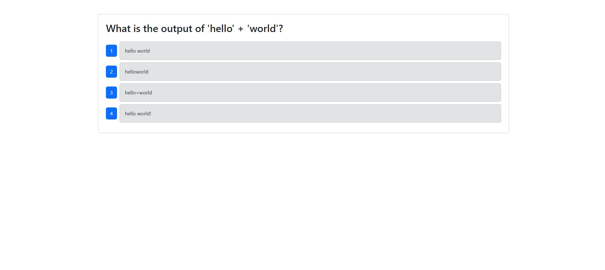

# Binary-Brain-w-CICD

https://binary-brain-w-cicd.onrender.com

## Description
Binary Brain is a quiz that tests your knowledge of Python. It presents you with a series of ten questions and keeps track of your score to show you your results at the end of the quiz. It was built using a MERN stack and was tested using Cypress. 

## Table of Contents
- [Installation](#installation)
- [Usage](#usage)
- [License](#license)
- [Contributing](#contributing)
- [Tests](#tests)
- [Questions](#questions)

## Installation
This app uses Node, Express,  MongoDB, React, and Cypress. Make sure to do an npm install to get access to all of the necessary node modules as well as create your own gitignore. You will also need to create you're own environment folder for your own MONGODB_URI.

## Usage
When first opening up the app you are presented with a start button. Simply press it to get started with your quiz. You will be presented with a total of ten questions with multiple choice options. Clicking on the button of the answer you believe to be correct will present you with the next question until you have answered all of the questions. 

You will then be presented with your results and a take quiz again button that can be clicked should you wish to try again.

  ## License
    MIT
    
  https://opensource.org/licenses/MIT

## Contributing
N/A

## Tests
I have recently added a CICD pipeline that automatically does component testing using Cypress when merging feature branches to the develop branch. There is also automatic deployment to Render when merging the develop branch to the main branch.

## Questions
GitHub: [pauletters](https://github.com/pauletters)
Email: pauletters87@gmail.com